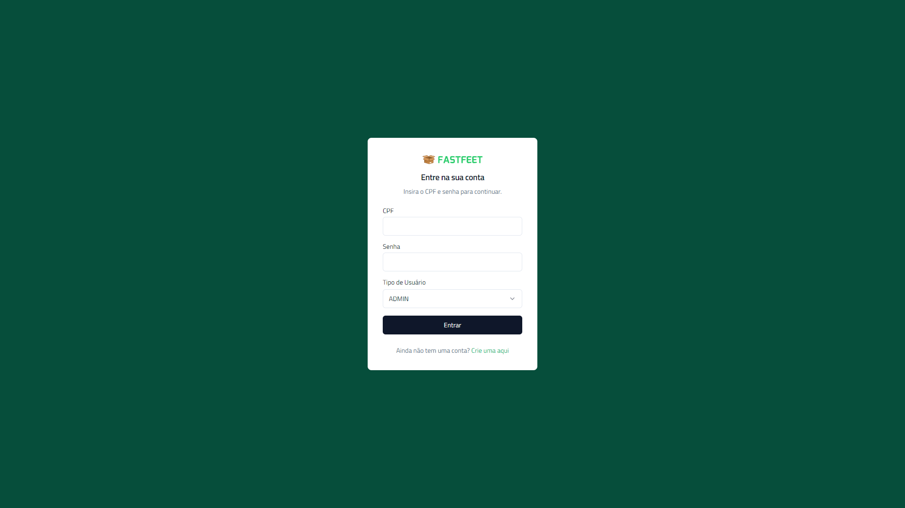
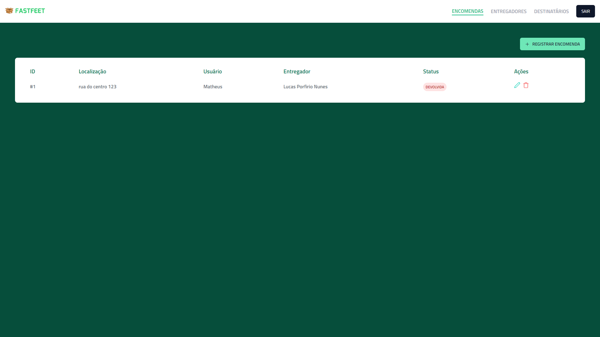
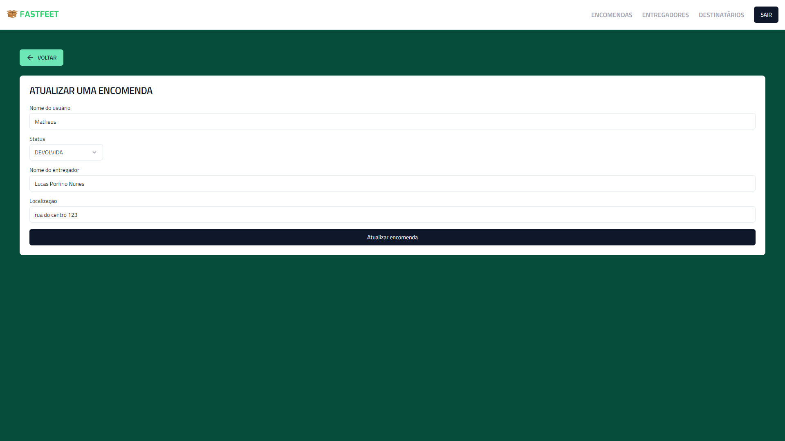
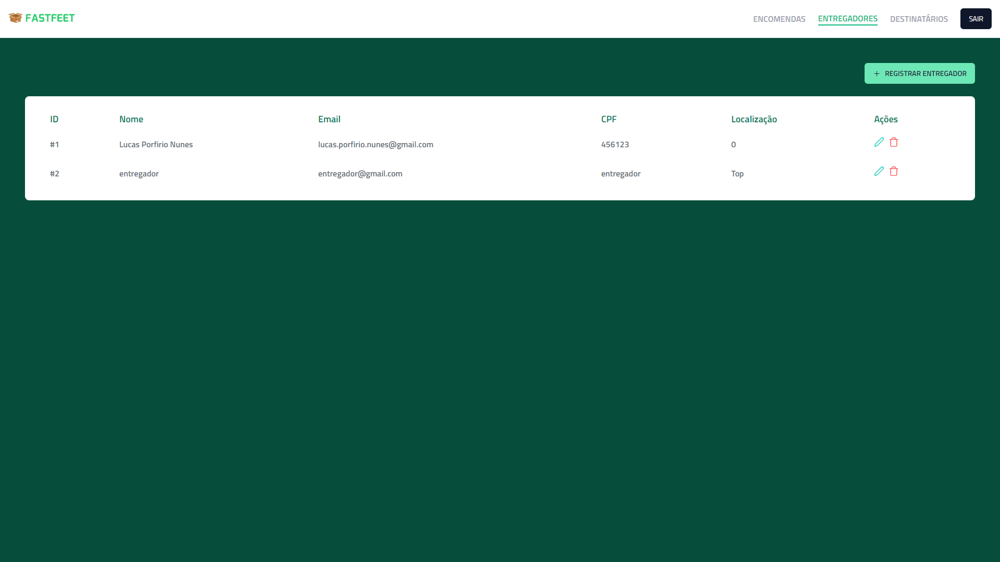
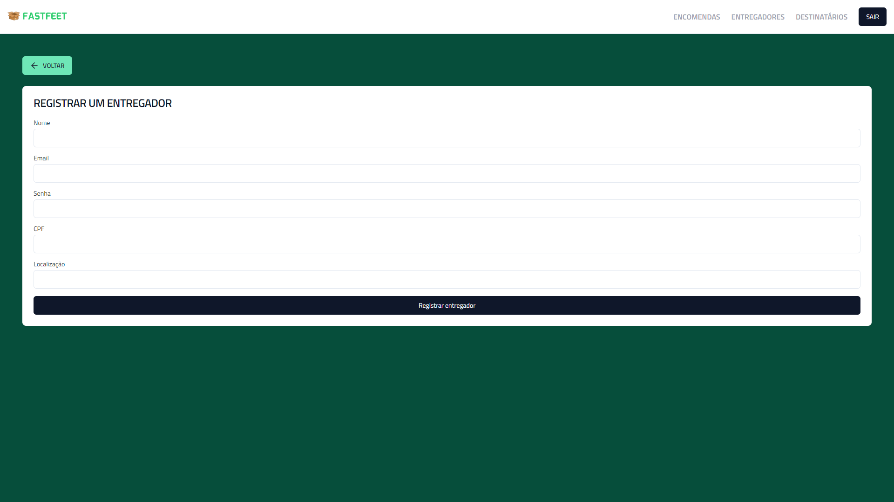
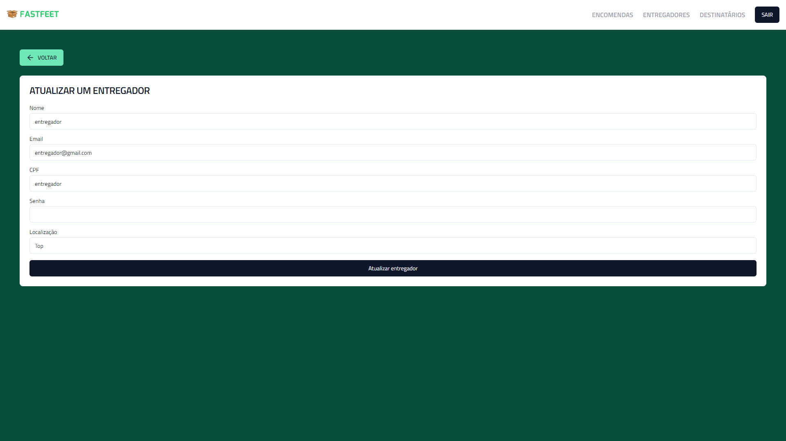
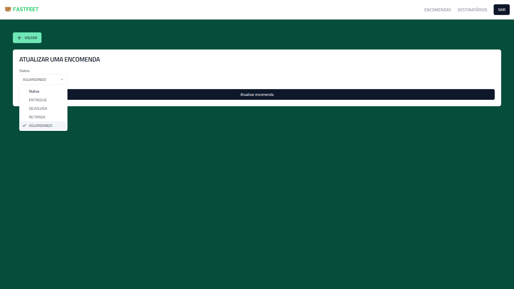
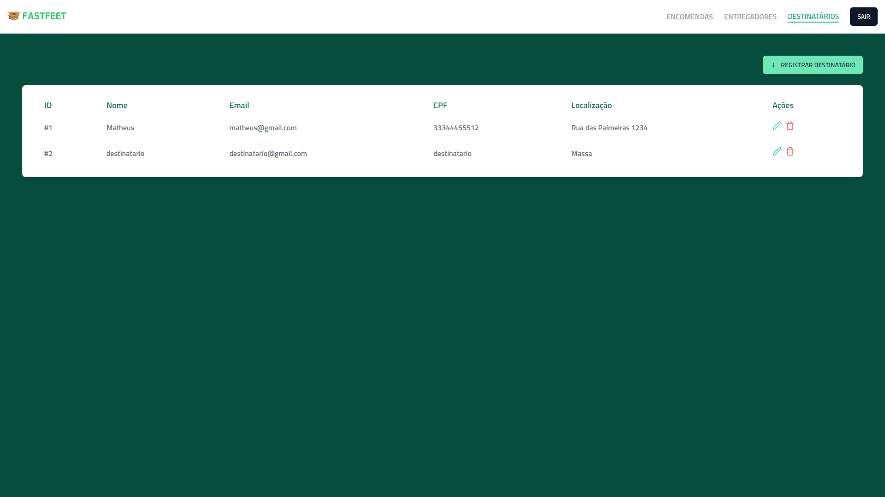

<h1 align="center">
  

Trata-se de uma aplicação para gerenciamento de encomendas para uma distribuidora fictícia, a FastFeet.

</h1>

# Índice
 - [Tecnologias utilizadas](#-tecnologias)
 - [Funcionalidades](#-funcionalidades)
 - [Acessando a aplicação](#-acessando-a-aplicação)
 - [Interfaces da aplicação](#-interfaces-da-aplicação)

---

## ⚙ Tecnologias

 - Node.js
 - Express.js
 - React
 - PostgreSQL
 - Shadcn
 - Render

---

## ✨ Funcionalidades

- Cadastro de Administradores
- *Somente admin pode realizar operações de CRUD nas encomendas*
- *Somente admin pode realizar operações de CRUD dos entregadores.*
- *Somente admin pode realizar operações de CRUD dos destinatários.*
- Cadastro de Entregadores
 - *Marcar uma encomenda como entregue*
 - *Marcar uma encomenda como devolvida*
 - *Somente o entregador que retirou a encomenda pode marcar ela como entregue.*
 - *Não deve ser possível um entregador listar as encomendas de outro entregador.*
- Cadastro de Encomendas
- Cadastro de Destinatários

---

## 💻 Acessando a aplicação

https://fastfeet-fullstack-client-1.onrender.com/

---

## 📸 Interfaces da aplicação

> Página de Login

 

> Página de Encomendas

 

 > Página de Cadastrar Encomenda

 

 > Página de Atualizar Encomenda

 

 > Página de Entregadores

 

 > Página de Cadastrar Entregador

 

 > Página de Atualizar Entregador

 

 > Página Logado como Entregador

 

 > Página de Alterar Status de Encomenda como Entregador

 

 > Página de Destinatários

 

 > Página de Cadastrar Destinatário

 

> Página de Atualizar Destinatário

 

